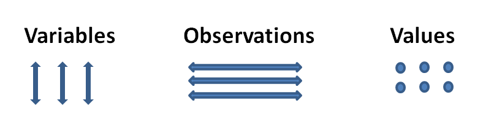

# Import {#import}

The first step in the typical data science project involves importing data into R. There are numerous packages for different data types all with varying preferences on speed and efficiency. Here are some R Packages for Importing Data into R: 

## **Tabular Data**

Tabular data consists of variables, observations and values.



  * [`readr`](https://cran.r-project.org/web/packages/readr/index.html): Read flat/tabular text files from disk (or a connection). readr has some benefits over the base/utils version as smart column type parsing and not automatically converting strings into factors.
```{r, eval=FALSE, message=FALSE, warning=FALSE, include=TRUE}
dat <- read_csv("file_name.csv")

```

  
  * [`readxl`](https://cran.r-project.org/package=readxl): Import excel files into R. Supports '.xls' via the embedded 'libxls' C library (http://sourceforge.net/projects/libxls/) and '.xlsx' via the embedded 'RapidXML' C++ library (http://rapidxml.sourceforge.net). Works on Windows, Mac and Linux without external dependencies.

## **Hierarchical Data**

Hierarchical Data is a tree-structure such as [XML](https://en.wikipedia.org/wiki/XML), HTML, JSON.

  * [`jsonlite`](https://cran.r-project.org/web/packages/jsonlite/index.html): A fast JSON parser and generator optimized for statistical data and the web. 
  * [`xml2`](https://cran.r-project.org/web/packages/xml2/index.html): Work with XML files using a simple, consistent interface. Built on top of the 'libxml2' C library.
  * [`rvest`](https://cran.r-project.org/web/packages/rvest/index.html): Wrappers around the 'xml2' and 'httr' packages to make it easy to download, then manipulate, HTML and XML.

## **Relational Data**

  * [`DBI`](https://cran.r-project.org/web/packages/DBI/index.html): A database interface definition for communication between R and relational database management systems. All classes in this package are virtual and need to be extended by the various R/DBMS implementations.
  * [`RMySQL`](https://cran.r-project.org/web/packages/RMySQL/index.html): Implements 'DBI' Interface to 'MySQL' and 'MariaDB' Databases.

## **Distributed Data**

Distributed Data consists of non-relational formats with quick access to data over a large number of nodes.
  
  * [`sparklyr`](http://spark.rstudio.com/): Filter and aggregate Spark datasets then bring them into R for analysis and visualization.
  
  
  
## **Different Data Formats**

  * [`haven`](https://cran.r-project.org/web/packages/haven/index.html): Import and Export 'SPSS', 'Stata' and 'SAS' Files. 
  
```{r}
library(haven)
claims <- read_sas("http://www.businessandeconomics.mq.edu.au/our_departments/Applied_Finance_and_Actuarial_Studies/acst_docs/glms_for_insurance_data/data/claims_sas_miner.sas7bdat")

head(claims)

```


* [`foreign`](https://cran.r-project.org/web/packages/foreign/index.html): Functions for reading and writing data stored by some versions of Epi Info, Minitab, S, SAS, SPSS, Stata, Systat and Weka and for reading and writing some dBase files.

