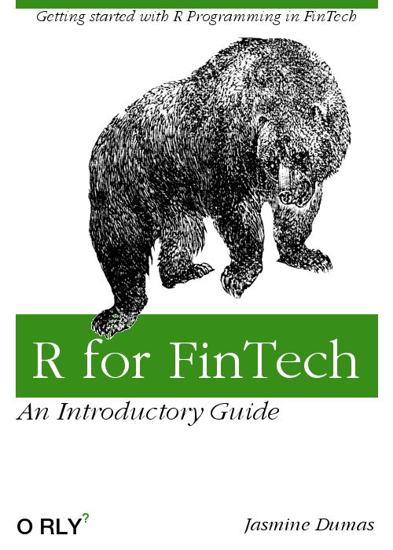

--- 
title: "R for FinTech"
author: "Jasmine Dumas"
date: "`r Sys.Date()`"
site: bookdown::bookdown_site
output:
  bookdown::html_book:
    theme: cosmo
always_allow_html: yes
documentclass: book
bibliography: [book.bib, packages.bib]
biblio-style: apalike
link-citations: yes
github-repo: jasdumas/r4fintech
description: "A guidebook for getting started with R Programming with Financial Technology (FinTech) applications"
---

# Introduction

## **Welcome**

Welcome to **R for FinTech**! This guidebook has emphasis on ["FinTech"](https://en.wikipedia.org/wiki/Financial_technology) or Financial Technology applications in data analysis. Examples and packages in this guidebook will highlight common methods in computational programming for banking, insurance, and investing.

## **The purpose of this book**

When starting out in a new industry or a new programming language like R, it can be difficult to learn how to apply industry-specific methods given the vast amount of R packages available and the sparsity of relative examples using financial data on question and answer forums. The purpose of this book is to provide introductory resources and modular code examples to enable the effective communication and translation of financial data to actionable-insights.

## **How this book is organized**

The organization of this guidebook is inspired by the book [**R for Data Science**](http://r4ds.had.co.nz/) from Garrett Grolemund and Hadley Wickham which explores each step of the data science process from acquiring data on the web to communicating the outputs with dynamic reports and dashboards. Each section of the guidebook is meant to follow the typical data science workflow when followed in order however when jumping into existing projects which is a common approach in industry, the sections can be referenced as needed as standalone tutorials.

## **Prerequisites**

**If you don't already have R or RStudio:**

* Download R at  [https://www.r-project.org/alt-home/](https://www.r-project.org/alt-home/)
* Download RStudio at [https://www.rstudio.com/products/rstudio/download/](https://www.rstudio.com/products/rstudio/download/)
